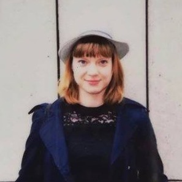

---
---

<link rel="stylesheet" href="styles.css" type="text/css">

I am a  PhD student at the York Music Psychology Group at the University of York and am recipient of the Sir Jack Lyons Research Scholarship from the Department of Music, which helps me cover my fees and pays a small stipend. To cover my living expenses I work up to three jobs, don't ask me how. I love to analyze data to answer research questions and get new insights on whatever I am working on. Currently I investigate questions related music-induced emotion and whether or not these are reflected in facial expressions of emotion. 

I graduated from the [University of Cologne](http://portal.uni-koeln.de/en/sub/uoc-home) with a BA in Music and Dutch Cultural Studies in 2013. After learning Norwegian to fulfill the admission requirements I got admitted to the University of Oslo and completed my MA in Musicology in 2016. Since 2017 I am working towards my PhD in Music Psychology under the supervision of Dr. Hauke Egermann (York Music Psychology Group) and Dr. Nick Barraclough (Department of Psychology) at the University of York. I expect to graduate by the end of 2020.

